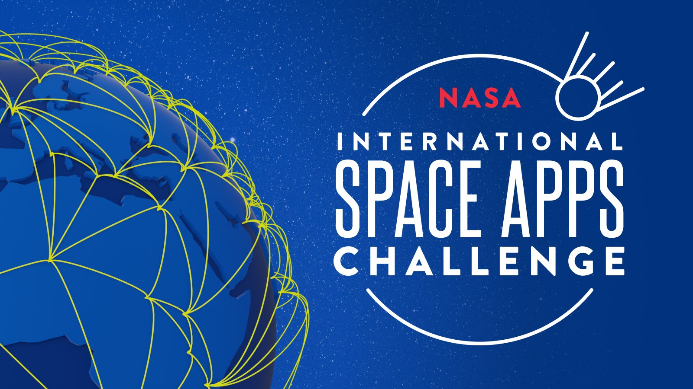

## Space Apps 2025

This repository contains the repository of the project presented by the team pinchohierba in the NASA Space Apps challenge 2025 Zaragoza



## Content of the project

// TODO

## Technologies Used

- **Frontend** Angular
- **Backend** NestJS
  

## How to run the App

### Frontend

```bash
cd <route_to_project>/frontend
npm install
npm start
```

### Backend

```bash
cd <route_to_project>/backend
npm install
npm start
```
